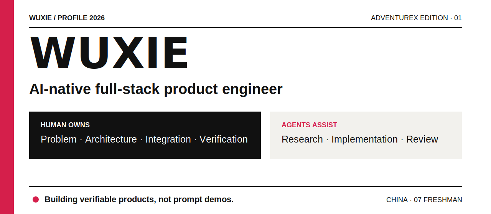
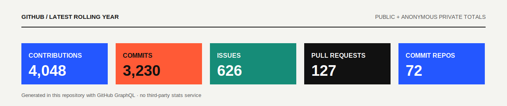
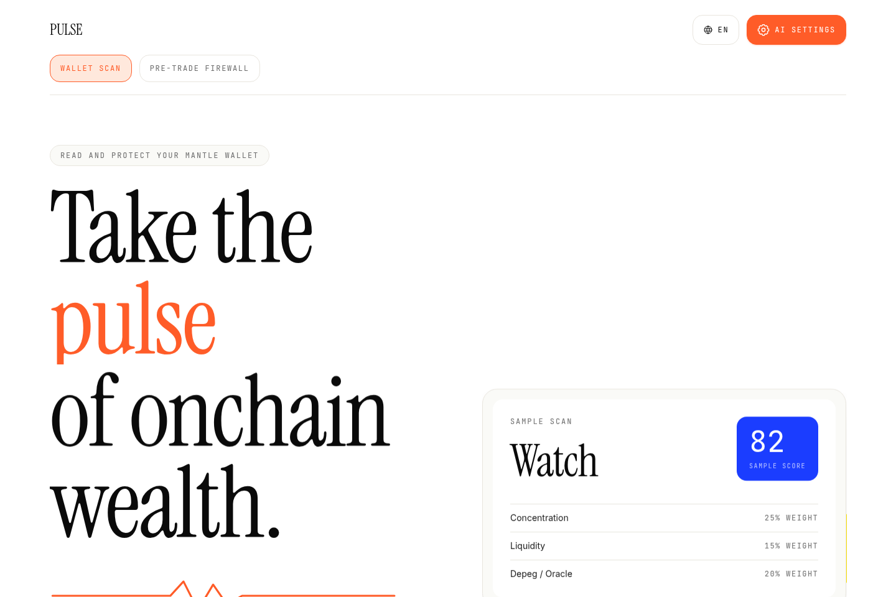
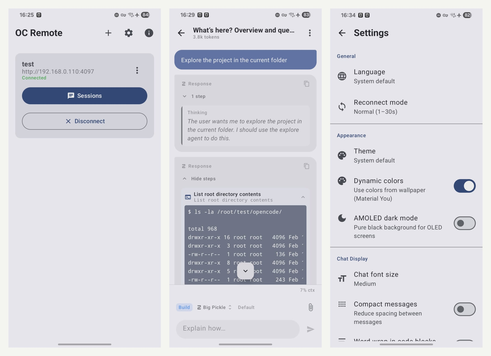
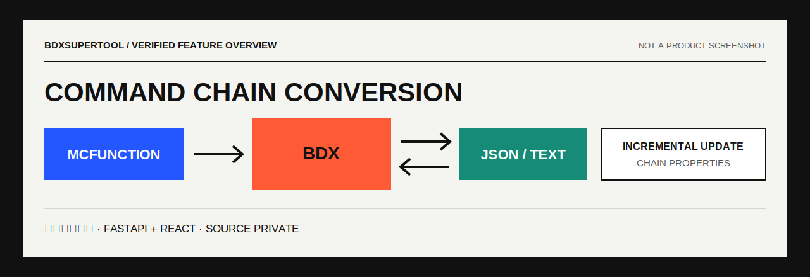
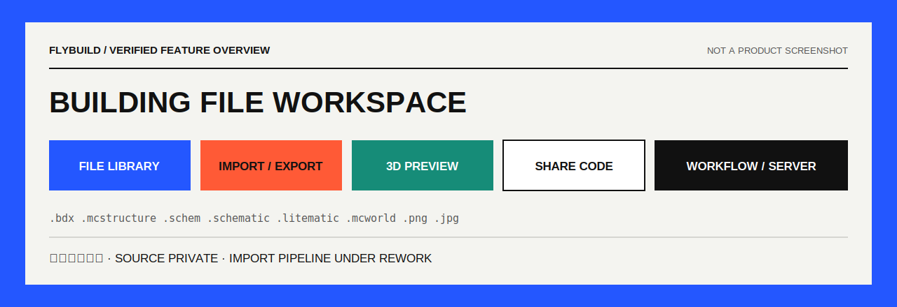

  <picture>
    <source media="(max-width: 600px)" srcset="./assets/cover-mobile.svg" />
    
  </picture>

我做能直接使用的产品，也喜欢把复杂系统整理成顺手的工具。从产品定义、交互和系统设计，到前后端实现、部署与验证，我会完整负责一条产品线。

Agents 已经进入我的日常开发流程；需求取舍、架构决策、集成质量和最终结果仍由我负责。

`Product` · `Full-stack` · `AI agents` · `Developer tools` · `Interaction design`

  <a href="https://wuxie233.com">Website</a> ·
  <a href="https://space.bilibili.com/254160530">Bilibili</a> ·
  <a href="mailto:445714414@qq.com">Email</a>

<picture>
  <source media="(max-width: 600px)" srcset="./assets/github-stats-mobile.svg" />
  
</picture>

## Products

### [Pulse](https://pulse.wuxie233.com) · 交易前，看清钱包风险

面向 Mantle 的钱包健康分析与交易前风险工具。确定性模型先计算集中度、流动性、协议依赖等五类风险，AI 再解释结果；提交交易前还会解码 calldata，给出安全、谨慎或危险判断。报告哈希可由具备 ERC-8004 身份的 Agent 发布到链上复核。

**我负责：** 产品定义、风险模型、合约、前后端、交互、部署。 
**可验证：** [线上 App](https://pulse.wuxie233.com) · [公开仓库](https://github.com/Wuxie233/pulse)

`TypeScript` `Onchain` `Risk model` `AI explanation`

---

### [oc-remote](https://github.com/Wuxie233/oc-remote) · 把本地 Coding Agent 带到手机上

  <picture>
    <source media="(max-width: 600px)" srcset="./assets/oc-chat.jpg" />
    
  </picture>

基于 [`crim50n/oc-remote`](https://github.com/crim50n/oc-remote) 持续开发的 Android 客户端，用手机连接远端 OpenCode / Codex 工作环境。我的扩展包括 Codex app-server、移动端 Terminal / PTY、多服务器管理、15 种语言、离线草稿，以及大型会话的稳定性修复。

**我负责：** 上述功能的设计、实现、移动端体验和问题修复。 
**可验证：** [Fork 与提交记录](https://github.com/Wuxie233/oc-remote)

`Kotlin` `Android` `Codex app-server` `PTY`

---

### [BDXSuperTool](https://bdx.wuxie233.com/) · 命令链格式转换工具

<picture>
  <source media="(max-width: 600px)" srcset="./assets/bdx-overview-mobile.svg" />
  
</picture>

把 Minecraft 基岩版命令链的转换和维护集中到一个 Web 工具里。支持 `MCFunction → BDX`、`BDX → MCFunction / JSON`、`文本 → BDX`，并提供增量更新、命令链属性配置和深浅主题。

**个人独立开发，源码私有。** 
**可验证：** [线上产品](https://bdx.wuxie233.com/)

`FastAPI` `React` `Minecraft Bedrock` `Format conversion`

---

### [FlyBuild](https://build.flyshop.chat/) · 跨格式建筑工作台

<picture>
  <source media="(max-width: 600px)" srcset="./assets/flybuild-overview-mobile.svg" />
  
</picture>

面向 Minecraft 建筑文件的管理与转换工作台。现有产品包含文件管理、导入导出任务、3D 预览、分享码、工作流和服务器配置，覆盖 `.bdx`、`.mcstructure`、`.schem`、`.schematic`、`.litematic`、`.mcworld` 及常见图片格式。

**个人独立开发，源码私有。** 产品正在运营，社群成员近 500 人。 
**可验证：** [线上产品](https://build.flyshop.chat/)

`Web app` `3D preview` `File pipeline` `Workflow`

## Engineering Work

### [micode](https://github.com/Wuxie233/micode)

面向 OpenCode 的多 Agent 工程插件：把需求对齐、规划、并行实现、审查和恢复放进一条可追踪的工作流。项目从 [`vtemian/micode`](https://github.com/vtemian/micode) 出发，后来重做了工作流、领域边界、GitHub 生命周期和分层知识系统。

### [RimWorld AI](https://github.com/Wuxie233/RimWorldMod_RimWorldAI)

RimWorld 多 Agent 殖民地管理系统。游戏 Mod 通过 MCP 暴露受控工具，独立 Runtime 负责规划与调用，WebUI 负责状态、日志和人工控制。

### [SpireVibePlaying](https://github.com/Wuxie233/SpireVibePlaying)

《Slay the Spire 2》AI 辅助 Mod。它跟踪牌堆并计算抽牌概率，用确定性 DFS 求解战斗，再让 LLM 结合上下文解释建议。

## Capability Stack

| Product | Engineering | AI systems |
|---|---|---|
| 产品定义、交互设计、风险与失败路径 | TypeScript、Python、Kotlin、C#、React、FastAPI | LLM API、MCP、Function Calling、多 Agent 编排 |
| 原型验证、Web / Android 体验 | GitHub Actions、容器、部署、日志与测试 | 工具权限、上下文管理、人工接管与结果验收 |

## Elsewhere

<table>
  <tr>
    <td width="96"></td>
    <td><strong><a href="https://space.bilibili.com/254160530">无邪大得很</a></strong> 在 B 站分享 Minecraft 命令、工具开发、创意和实现思路。相比完整教学，我更常讲清一个想法怎样落地。</td>
  </tr>
</table>

<strong>Wuxie · Build the product, then prove it works.</strong>

