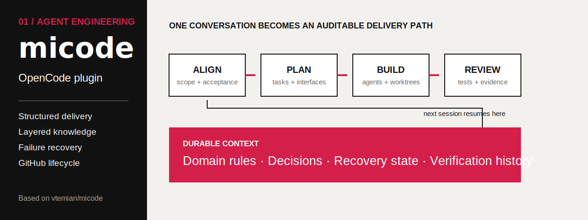
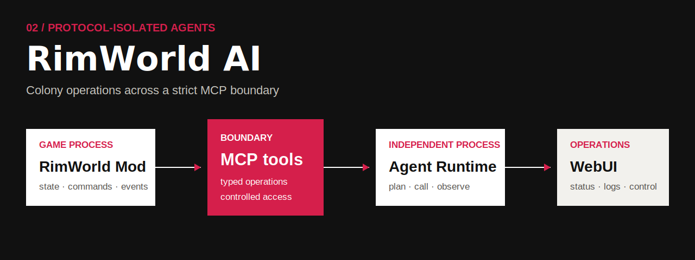
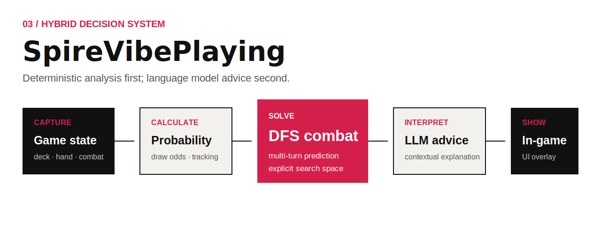
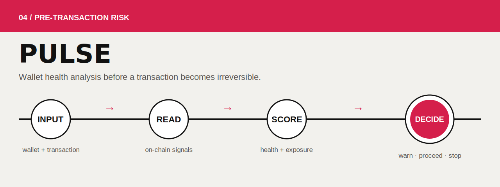
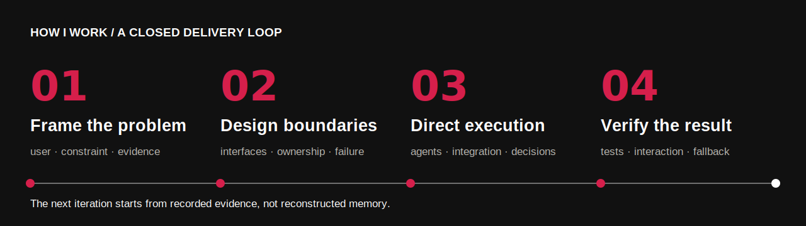

  <picture>
    <source media="(max-width: 600px)" srcset="./assets/cover-mobile.svg" />
    
  </picture>

我从高考结束后持续使用 Agents 完成真实项目。我的职责不是转发模型输出，而是确定问题、系统边界和验收标准，组织实现，再对集成结果与失败路径负责。

目前担任 **Minecraft 网络服技术负责人及核心系统开发**，项目正在开发，计划上线网易平台。同时准备 **AdventureX 2026**，寻找愿意从真实问题出发、一起完成可验证原型的队友。

`Product judgment` · `System architecture` · `Full-stack delivery` · `UX quality` · `Agent orchestration`

---

## Selected work

### 01 · [micode](https://github.com/Wuxie233/micode)

<picture>
  <source media="(max-width: 600px)" srcset="./assets/project-micode-mobile.svg" />
  
</picture>

面向 OpenCode 的结构化多 Agent 工程插件。它把需求对齐、规划、并行实现、审查和恢复组织成可追踪的交付路径，并用分层知识保存跨会话上下文。

**我的工作：** 工作流设计、领域边界、Agent 编排、GitHub 生命周期、集成与验收。项目最初基于 [`vtemian/micode`](https://github.com/vtemian/micode)，随后进行了实质重构与扩展。

`TypeScript` `OpenCode` `Multi-agent` `Workflow design`

---

### 02 · [RimWorld AI](https://github.com/Wuxie233/RimWorldMod_RimWorldAI)

<picture>
  <source media="(max-width: 600px)" srcset="./assets/project-rimworld-mobile.svg" />
  
</picture>

RimWorld 多 Agent 殖民地管理系统。游戏 Mod 只通过 MCP 暴露受控工具，独立 Agent Runtime 负责规划和调用，WebUI 提供运行状态、日志与人工控制。

**我的工作：** 协议边界、运行时架构、多 Agent 协作、工具接入、WebUI 集成和故障修复。公开仓库保留了 Agent 协作痕迹及问题处理记录。

`C#` `Python` `MCP` `Multi-agent` `WebUI`

---

### 03 · [SpireVibePlaying](https://github.com/Wuxie233/SpireVibePlaying)

<picture>
  <source media="(max-width: 600px)" srcset="./assets/project-spire-mobile.svg" />
  
</picture>

《Slay the Spire 2》AI 辅助 Mod。系统先跟踪牌堆与计算抽牌概率，再用 DFS 做战斗求解和多回合预测；LLM 负责结合上下文解释建议，结果显示在游戏内界面。

**我的工作：** 状态捕获、确定性求解、模型接入、交互界面与整体集成。目前没有公开 Release、外部用户数据或可复核 Demo，因此不宣称规模化使用。

`C#` `DFS` `Probability` `LLM` `In-game UI`

---

### 04 · [Pulse](https://github.com/Wuxie233/pulse)

<picture>
  <source media="(max-width: 600px)" srcset="./assets/project-pulse-mobile.svg" />
  
</picture>

面向 Mantle 的钱包健康分析与交易前风险防线。系统用确定性五维模型评估钱包状态，再由 AI 解释风险；报告哈希由具备 ERC-8004 身份的 Agent 发布到链上，可通过公开页面复核。交易提交前，防火墙会解码 calldata 并给出安全、谨慎或危险判断。

**我的工作：** 产品问题定义、风险模型、合约与前后端实现、交互体验、部署和演示闭环。当前有[线上 App](https://pulse.wuxie233.com)、已验证合约与公开验证样例。

`TypeScript` `Wallet analysis` `Risk UX` `Mantle`

---

## How I work

<picture>
  <source media="(max-width: 600px)" srcset="./assets/process-mobile.svg" />
  
</picture>

1. **确认问题。** 明确用户、约束、非目标与可接受的验收证据。
2. **设计边界。** 确定组件职责、接口、权限、错误路径与人工接管方式。
3. **组织实现。** 把可并行工作交给不同 Agents，同时保留清晰归属与最终决策权。
4. **验证结果。** 使用构建、测试、日志、真实交互和主动制造的失败场景验收。

Agent 是实现与审查工具。产品判断、架构选择、集成质量和最终结果由我负责。

---

## AdventureX 2026

目前方向开放。我更关心题目是否来自真实问题、价值能否测量、原型能否现场演示，以及模型、网络或硬件失效后是否还能降级运行。

我不限定队友职位。产品与用户研究、交互与视觉、硬件落地、AI 算法，或掌握某个垂直场景真实需求的人都可以。希望你有自己的判断和实践，愿意一起砍需求、做验证，并把贡献归属说清楚。

**补充经历：** 大一获蓝桥杯全国总决赛国家三等奖。

  <strong>GitHub · <a href="https://github.com/Wuxie233">Wuxie233</a>&nbsp;&nbsp;&nbsp;|&nbsp;&nbsp;&nbsp;QQ · 445714414</strong>

